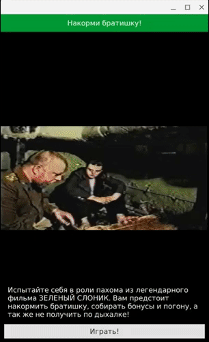

# Накорми братишку

 > Все мы с чего-то начинали



Подобные программки я начал клепать ещё на первом курсе. По факту, всё крутиться вокруг этих строк кода. Вид сверху. Епифанцев осуществляет преследование братишки, который решил приготовить завтрак. Базовый пример применения общеобразовательных познаний о тригонометрии на практике.

```
Timer{
  id: epifuntimer
  interval: 50
  repeat: true
  onTriggered:{
    var x2x1,y2y1,q,z;
    x2x1=epifan.centerX()-player.centerX();
    y2y1=epifan.centerY()-player.centerY();
    z=0;
    q=1;
    if(x2x1>0){
        epifan.x--;
        q=(y2y1>0)?-1:1;
        z=(y2y1>0)?180:0;
    }
    if(x2x1<0){
        epifan.x++;
        q=(y2y1>0)?1:-1;
        z=(y2y1>0)?180:0;
    }
    epifan.y+=(y2y1>0)?-1:1;
    epifan.rotation=q*(Math.atan(Math.abs(x2x1/y2y1))/Math.PI*180)+z;
  }
}
```

Код оставил неизменным. Мне тогда было 16?